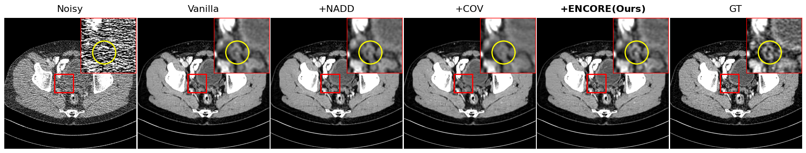

# ENCORE: Efficient Noise Context-Aware Representation for Low-Dose CT Denoising

Official PyTorch implementation for **[ENCORE: Efficient Noise Context-Aware Representation for Low-Dose CT Denoising](https://arxiv.org)**.

## Installation
### 1. Tested Environment
This repository has been tested with:

- **OS**: Linux (Ubuntu)
- **Python**: 3.11
- **PyTorch**: 2.7.0 (CUDA 12.8)
- **GCC**: 11.4.0
- **Key Dependencies**: `einops`, `pydicom`, `leapctype`, ... etc

Or, we recommend using this Docker image:
```bash
docker pull medisyslab/leap:2.7.0
```

### 2. Install Custom CUDA Extensions

First, clone and install the **FLEET** package from GitHub, then build the local CUDA extensions using the provided `Makefile`:

```bash
# Clone and install FLEET extension
git clone https://github.com/minwoo-yu/FLEET.git

# Build and install CUDA extensions (local_autocov, flying_conv, and FLEET)
make
```

## Getting Started

### 1. Datasets
Download the datasets:
- **Mayo 2016** (2016 NIH-AAPM-Mayo Clinic Low Dose CT Grand Challenge): [AAPM Grand Challenge Page](https://www.aapm.org/GrandChallenge/LowDoseCT/)
- **Mayo 2020** (LDCT-and-Projection-Data): [TCIA Collection Page](https://www.cancerimagingarchive.net/collection/ldct-and-projection-data/)

### 2. Pretrained Checkpoints
Pretrained model weights can be downloaded from the **[ENCORE GitHub Releases](https://github.com/minwoo-yu/ENCORE/releases)** page.

Save the downloaded model checkpoints into the `trained_models/` directory:
```bash
mkdir -p trained_models
# Place downloaded .pt model files inside trained_models/
```

### 3. Preprocessing & Generation
```bash
python dataset_gen_train.py
python dataset_gen_test_2016.py
python dataset_gen_test_2020.py
```

### 4. Training
Run training with a configuration file specified from the `yaml/` directory:

```bash
python main.py --config yaml/unet+encore --save_dir experiment --save experiment_name
```

### 5. Demo
You can run [`demo.ipynb`](demo.ipynb) to test and visualize the denoising performance of the trained models:

